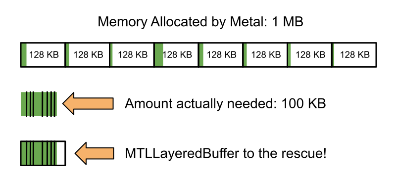

# Layered Buffer

A `MTLLayeredBuffer` (layered buffer) is a high-level wrapper over a `MTLBuffer`. A layered buffer automatically manages resource creation, memory reallocation, and zero-cost debug labels. By combining several small buffers into one larger buffer, it conserves memory while making working with numerous unique buffers much easier. It saves several megabytes of memory in [scene color reconstruction](https://github.com/philipturner/scene-color-reconstruction), where a separate buffer is required for each stage of the frequently used compact/allocate algorithm.

> Note: `MTLLayeredBuffer` serves two distinct and orthogonal purposes. It was originally created to solve a bottleneck in memory consumption, but it also abstracts the low-level management of its underlying buffer from the user. In a sense, `MTLLayeredBuffer` encapsulates `MTLBuffer` like the Swift `Array` encapsulates `UnsafeMutableRawPointer`. 

`MTLLayeredBuffer` serves as a drop-in replacement for `MTLBuffer`. Upon importing ARHeadsetKit, every Metal API call that accepts a `MTLBuffer` also accepts layered buffers.

## How it works

To realize the need for the layered buffer, one must first understand how Metal allocates memory. To synchronize access to memory across the CPU, GPU, and their caches, Metal allocates buffers and textures in a page table, similarly to how virtual memory is allocated. When the GPU accesses a resource, Metal blocks the progression of a command buffer until every accessed page is safe to use.

The size of pages varies and is opaque to the developer. To see it in action, allocate buffer containing 1 KB of memory and view it in Metal Frame Capture. Its allocated size is either 16 KB, 32 KB, 64 KB, or 128 KB. With the largest page size, just 8 one-byte buffers could consume a megabyte. When [scene color reconstruction](https://github.com/philipturner/scene-color-reconstruction) was first implemented in March 2021, there were over 100 small buffers, wasting up to 10 megabytes of memory. 

This problem did more than just harm performance: one also had to manage initialization code and debug labels for each individual buffer. In addition, every buffer had to periodically double its capacity (similarly to a Swift array) to keep up with the expansion of the scene mesh. Managing all of this code was a headache.

To simplify and optimize usage of the compact/allocate algorithm, buffers for each stage were merged into one layered buffer. Unlike with a `MTLHeap`, one has full control over the layout of the layers, and doubling every layer's capacity at once takes a single function call. To locate the layers, an array contains each layer's beginning within the encapsulating `MTLBuffer`. Whenever the buffer expands, it iterates over every case in a `MTLBufferLayer` enumeration, accumulating chunks of memory until the final buffer size is found. 

Having easily resizable memory like a Swift `Array` or a C++ `std::vector` is a massive help for any context involving a GPU. In ARHeadsetKit, both `CentralRenderer` and `InterfaceRenderer` use layered buffers to manage lists of object metadata that expand when the app inputs a large number of objects. The only alternative would be to set a fixed limit to how many `ARObject`'s or `ARInterfaceElement`'s one could render. 

`MTLLayeredBuffer` helps with more than just dynamic buffer expansion or compact/allocate. It makes building GPGPU workflows take a fraction of the time. Adding a new layer to a layered buffer takes two lines of code, while creating a new `MTLBuffer` and managing its expansion takes a dozen. This fact alone made offloading some of the functionality of `ARObject` to the GPU feasible for [AR MultiPendulum](https://github.com/philipturner/ar-multipendulum), reducing the burden on the already overloaded CPU. 

There are still some cases where a `MTLBuffer` is more appropriate, because there is a miniscule overhead of indexing into an array to retrieve a layer's offset. For buffers that far exceed 128 KB and are bound frequently, `SceneRenderer` uses standalone buffers.

## How to use (and how not to)

To create a `MTLLayeredBuffer`, first create an enumeration that conforms to the `MTLBufferLayer` protocol. Each case corresponds to a separate layer. Upon calling `getSize(capacity:)`, each case will calculate the size of its layer. In some cases, such as shader uniforms for rendering, the capacity parameter will be ignored and the layer's size will never change. Check out the [`MTLLayeredBuffer` standalone package](https://github.com/philipturner/MTLLayeredBuffer) for a code sample.

With the exception of very small constant data structures, every layer should be related in some way. For example, the following four layers are needed to render the 3D scene mesh on LiDAR-enabled devices:

- Layer 1: Contains every triangle in the scene mesh
- Layer 2: Contains scene triangles that survive GPU-accelerated culling.
- Layer 3: Contains every vertex in the scene mesh
- Layer 4: Contains scene vertices that survive GPU-accelerated culling.

The theoretical maximum size of layer 2 is that of layer 1&mdash;if every triangle survives culling, layer 1 will just be copied to layer 2. The same goes for layers 3 and 4. However, the number of vertices and triangles to not have a direct relationship. The ratio of vertices to triangles can be anywhere from 50% (for a flat sheet with no gaps) to 300% (for a single triangle). 

Combining all four layers into the same `MTLLayeredBuffer` would waste a massive amount of memory. In the worst case, there are 3x as many vertices as triangles. The `getSize(capacity:)` method of `MTLBufferLayer` must return a safe size in every plausible situation, so a fully enclosed mesh would consume 6x more memory than it should (300% / 50%). To conserve memory, the first two layers should be separated into one `MTLLayeredBuffer`, while the last two are part of their own.

## Alternatives considered

Related pieces of data are often grouped together into data structures (`struct` in Swift and C-based languages). This grouping results in a repeating pattern of elements spanning a massive memory allocation. However, that model doesn't always work for ARHeadsetKit. Some data might never be accessed, such as vertex normals, while other data is read so frequently that it belongs in Metal's `constant` address space. Having a uniform memory access pattern for every piece of data harms cache coherence and prevents key optimizations to memory-intensive compute shaders.

In addition, the compact/allocate algorithm does not have a one-to-one mapping between each type of data. In one stage, there may be 1000 elements, while in the next, there are 250. Using structs, the second layer would consume just as much memory as the first, leaving 750 elements empty. Repeating that for around 10 layers would waste a massive amount of memory. In addition, each struct would be so wildly complex that rearranging the layout of its members would break numerous compute shaders.
 
 In short, `MTLLayeredBuffer` is the only reasonable solution to some of the problems ARHeadsetKit faces. However, it can be applied to other problems outside of AR. For this reason, its use has been expanded to every Metal API call, from frequently used buffer bindings to the rarely encountered ray tracing commands. If you wish take advantage of the safety and productivity `MTLLayeredBuffer` provides, all you need to do is add a Swift package dependency to ARHeadsetKit.
